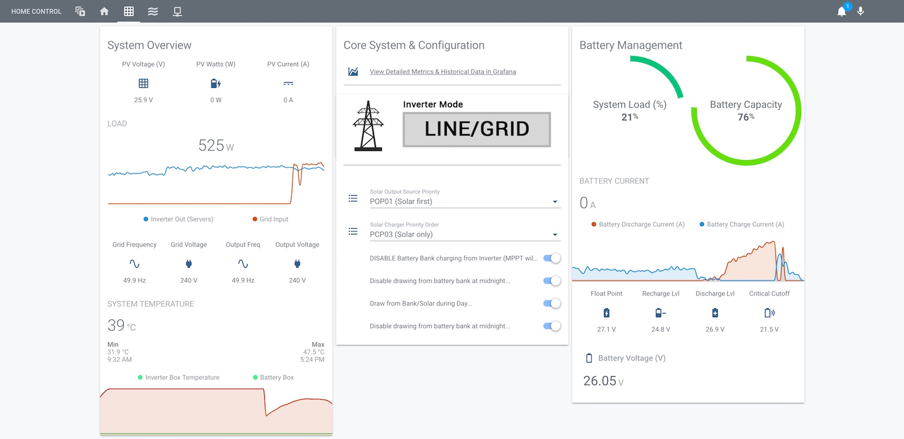
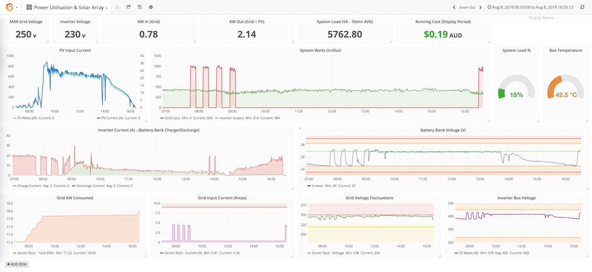
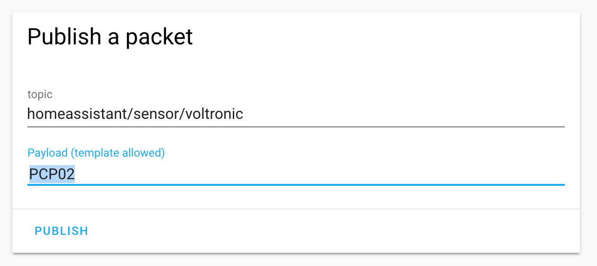

# A Docker based Home Assistant interface for MPP/Voltronic Solar Inverters 

This project [was derived](https://github.com/manio/skymax-demo) from the 'skymax' [C based monitoring application](https://skyboo.net/2017/03/monitoring-voltronic-power-axpert-mex-inverter-under-linux/) designed to take the monitoring data from Voltronic, Axpert, Mppsolar PIP, Voltacon, Effekta, and other branded OEM Inverters and send it to a [Home Assistant](https://www.home-assistant.io/) MQTT server for ingestion...

The program can also receive commands from Home Assistant (via MQTT) to change the state of the inverter remotely.

By remotely setting values via MQTT you can implement many more complex forms of automation _(triggered from Home Assistant)_ such as:

 - Changing the power mode to '_solar only_' during the day, but then change back to '_grid mode charging_' for your AGM or VLRA batteries in the evenings, but if it's raining (based on data from your weather station), set the charge mode to `PCP02` _(Charge based on 'Solar and Utility')_ so that the following day there's plenty of juice in your batteries...

 - Programatically set the charge & float voltages based on additional sensors _(such as a Zigbee [Temperature Sensor](https://www.zigbee2mqtt.io/devices/WSDCGQ11LM.html), or a [DHT-22 + ESP8266](https://github.com/bastianraschke/dht-sensor-esp8266-homeassistant))_ - This way if your battery box is too hot/cold you can dynamically adjust the voltage so that the batteries are not damaged...

 - Dynamically adjust the inverter's "solar power balance" and other configuration options to ensure that you get the most "bang for your buck" out of your setup... 

--------------------------------------------------

The program is designed to be run in a Docker Container, and can be deployed on a lightweight SBC next to your Inverter (i.e. an Orange Pi Zero running Arabian), and read data via the RS232 or USB ports on the back of the Inverter.


_Example #1: My "Lovelace" dashboard using data collected from the Inverter & the ability to change modes/configuration via MQTT._


_Example #2: Grafana summary allowing more detailed analysis of data collected, and the ability to 'deep-dive' historical data._


grafana-example.jpg

----

**Docker Hub:** [`bushrangers/ha-voltronic-mqtt`](https://hub.docker.com/r/bushrangers/ha-voltronic-mqtt/)

 

## Prerequisites

- Docker
- Docker-compose
- [Voltronic/Axpert/MPPSolar](https://www.ebay.com.au/sch/i.html?_from=R40&_trksid=p2334524.m570.l1313.TR11.TRC1.A0.H0.Xaxpert+inverter.TRS0&_nkw=axpert+inverter&_sacat=0&LH_TitleDesc=0&LH_PrefLoc=2&_osacat=0&_odkw=solar+inverter&LH_TitleDesc=0) based inverter that you want to monitor
- Home Assistant [running with a MQTT Server](https://www.home-assistant.io/components/mqtt/)


## Configuration & Standing Up

It's pretty straightforward, just clone down the sources and set the configuration files in the `config/` directory:

```bash
# Clone down sources on the host you want to monitor...
git clone https://github.com/ned-kelly/docker-voltronic-homeassistant.git /opt/ha-inverter-mqtt-agent
cd /opt/ha-inverter-mqtt-agent

# Configure the 'device=' directive (in inverter.conf) to suit for RS232 or USB.. 
vi config/inverter.conf

# Configure your MQTT server host, port, Home Assistant topic, and name of the Inverter that you want displayed in Home Assistant.
vi config/mqtt.json
```

Then, plug in your Serial or USB cable to the Inverter & stand up the container:

```bash
docker-compose up -d

```

_Note if you have issues standing up the image on your Linux distribution, you may need to manually build the image - This can be done by uncommenting the build flag in your docker-compose.yml file._

## Integrating into Home Assistant.

Providing you have setup [MQTT](https://www.home-assistant.io/components/mqtt/) with Home Assistant, the device will automatically register in your Home Assistant when the container starts for the first time -- You do not need to manually define any sensors.

From here you can setup [Graphs](https://www.home-assistant.io/lovelace/history-graph/) to display sensor data, and optionally change state of the inverter by "[publishing](https://www.home-assistant.io/docs/mqtt/service/)" a string to the inverter's primary topic like so:


_Example: Changing the Charge Priority of the Inverter_

**COMMON COMMANDS THAT CAN BE SENT TO THE INVERTER**

_(see [protocol manual](http://forums.aeva.asn.au/uploads/293/HS_MS_MSX_RS232_Protocol_20140822_after_current_upgrade.pdf) for complete list of supported commands)_


```
DESCRIPTION:                PAYLOAD:  OPTIONS:
----------------------------------------------------------------
Set output source priority  POP00     (Utility first)
                            POP01     (Solar first)
                            POP02     (SBU)

Set charger priority        PCP00     (Utility first)
                            PCP01     (Solar first)
                            PCP02     (Solar and utility)
                            PCP03     (Solar only)

Set the Charge/Discharge Levels & Cutoff
                            PBDV26.9  (Don't discharge the battery unless it is at 26.9v or more)
                            PBCV24.8  (Switch back to 'grid' when battery below 24.8v)
                            PBFT27.1  (Set the 'float voltage' to 27.1v)
                            PCVV28.1  (Set the 'charge voltage' to 28.1v)

Set other commands          PEa / PDa (Enable/disable buzzer)
                            PEb / PDb (Enable/disable overload bypass)
                            PEj / PDj (Enable/disable power saving)
                            PEu / PDu (Enable/disable overload restart);
                            PEx / PDx (Enable/disable backlight)
```

*NOTE:* When setting/configuring your charge, discharge, float & cutoff voltages for the first time, it's worth  understanding how to optimize charging conditions to extend service life of your battery: https://batteryuniversity.com/learn/article/charging_the_lead_acid_battery


### Using `inverter_poller` binary directly

This project uses heavily modified sources, from [manio's](https://github.com/manio/skymax-demo) original demo, and be compiled to run standalone on Linux, Mac, and Windows (via Cygwin).

Just head to the `sources/inverter-cli` directory and build it directly using: `cmake . && make`.

Basic arguments supported are:

```
USAGE:  ./inverter_poller <args> [-r <command>], [-h | --help], [-1 | --run-once]

SUPPORTED ARGUMENTS:
          -r <raw-command>      TX 'raw' command to the inverter
          -h | --help           This Help Message
          -1 | --run-once       Runs one iteration on the inverter, and then exits
          -d                    Additional debugging

```

### Bonus: Lovelace Dashboard Files

_**Please refer to the screenshot above for an example of the dashboard.**_

I've included some Lovelace dashboard files in the `homeassistant/` directory, however you will need to need to adapt to your own Home Assistant configuration and/or name of the inverter if you have changed it in the `mqtt.json` config file.

Note that in addition to merging the sample Yaml files with your Home Assistant, you will need the following custom Lovelace cards installed if you wish to use my templates:

 - [vertical-stack-in-card](https://github.com/custom-cards/vertical-stack-in-card)
 - [circle-sensor-card](https://github.com/custom-cards/circle-sensor-card)
